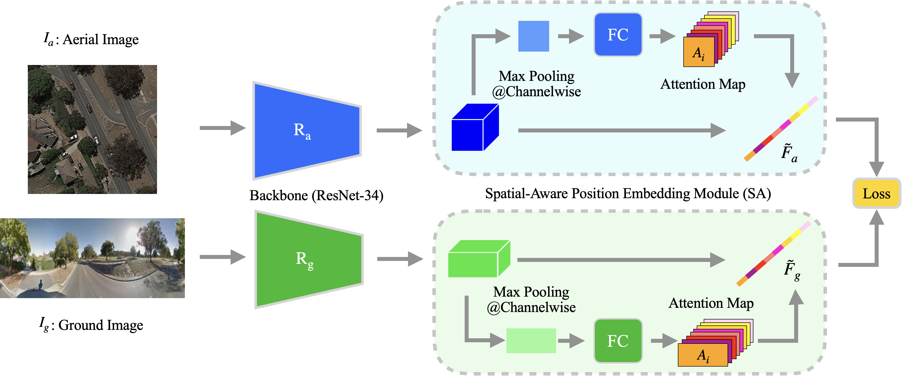

# LIGHTWEIGHT CNN FOR CROSS-VIEW GEO-LOCALIZATION USING AERIAL IMAGE

Implementation of the IGARSS2023 paper [LIGHTWEIGHT CNN FOR CROSS-VIEW GEO-LOCALIZATION USING AERIAL IMAGE]()

## USAGE

## PRE-TRAINED MODEL

## TRAINING

## TESTING
